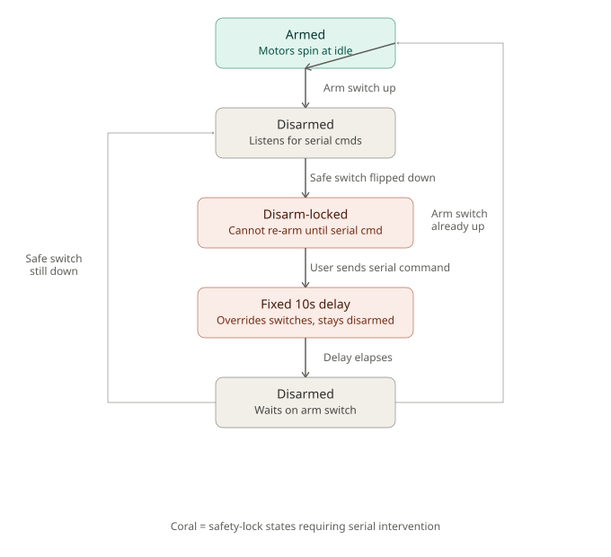

# Overview

When I was trying to tune the PID gain constants during testing, I stumbled upon an unfortunate oversight that I had made: there was no way to send information to the flight controller from a computer without completely re-flashing its entire firmware. 

This oversight is not just an annoyance; it is a genuine safety issue. The primary issue with uploading new firmware is that when the chip finishes downloading its new firmware and performs a soft reset, undefined behavior can occur.  I discovered this bug when I uploaded new firmware to the board, and the motors spun up when they were supposed to be disarmed. Fortunately, there were no propellers attached when that happened, but I might not be so lucky in the future. 

Serial communication is the solution to this problem, since it can be done on the fly. The danger however, is that it requires the user to be physically near the quadcopter while it is powered on in order to plug a usb cable into it. This new risk can be mitigated by implementing a multi-layer safety protocol. 

# Control Flow
At the highest level, control of my quadcopter originally came down to a single arm switch on the remote control. Toggled down, the quadcopter is armed. This means that the motors will spin at idle: the speed just before they produce enough lift to get the quadcopter off the ground. Toggled up, the quad is disarmed, and the motors do not spin at all. When the quad is disarmed, it also listens for a serial command over its virtual COM port to determine if it should send or receive data from a computer. 

The key thing to avoid is unintentionally arming the drone unexpectedly while the user is working on it. Of course, you could remove the propellers every time you want to update anything on the quad, but that takes much longer to do, and you would have to disconnect the battery anyway. At that point, you might as well just put the STM32 in bootloader mode and flash a whole new firmware. 

My first idea was this: Whenever the quadcopter receives anything over its serial port, it will set a flag to lock itself in disarm mode. That way, the user can take as long as they want, and the motors will remain motionless.

However, this leaves a gap in safety when the quadcopter has been disarmed but the user has not sent any command yet. If the user accidentally flipped the arm switch during this time, the motors would spin up and could hurt someone.

The bottom line is that there needs to be a way to totally safe the quad without needing to go near it. 

Luckily, there is still one free channel on my receiver that I can map to an unused switch on the quad. When this switch is flipped down and the ARM switch is flipped up (disarm position), the quadcopter will set the disarm lock flag, where the user must send a specific command over serial before the quad will re-arm. 

Once this command is sent, there will be a fixed 10 second delay to allow the user to unplug the usb cable and move a safe distance away. The delay overrides the switches and keeps the quad in disarm mode. However, the quad does not automatically arm itself after the delay is up; that still depends on the position of the primary arm switch. The purpose of the delay is to add an additional layer of safety, preventing a small mistake from causing a devastating injury. 

While this system may take a few extra hours to implement, it is important because it ensures that safety keeps up with my pace of development. 

