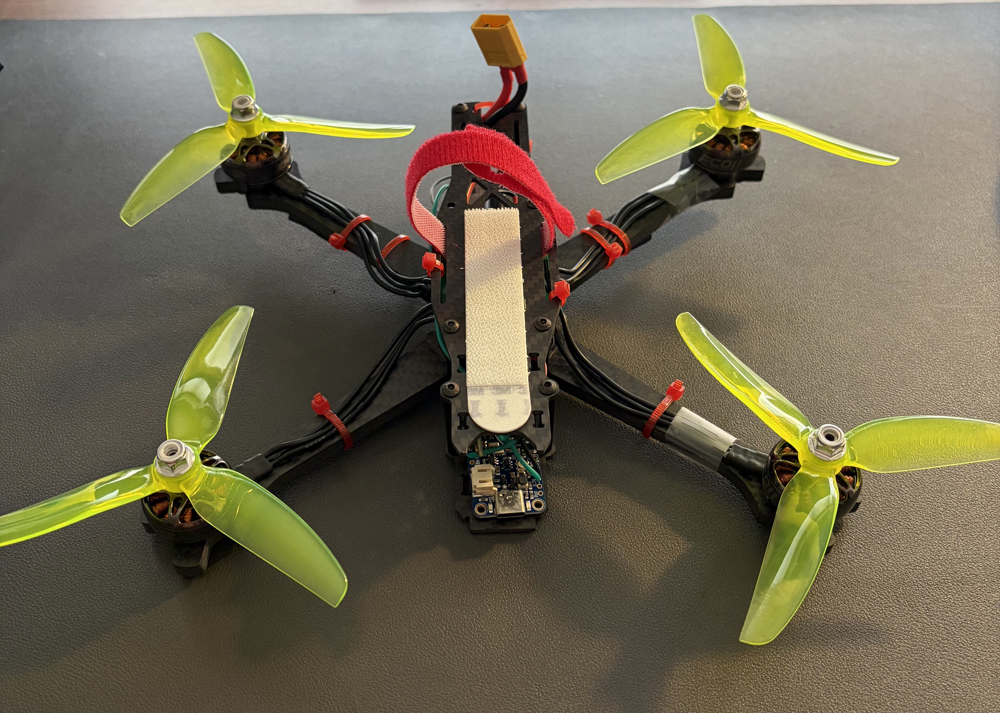
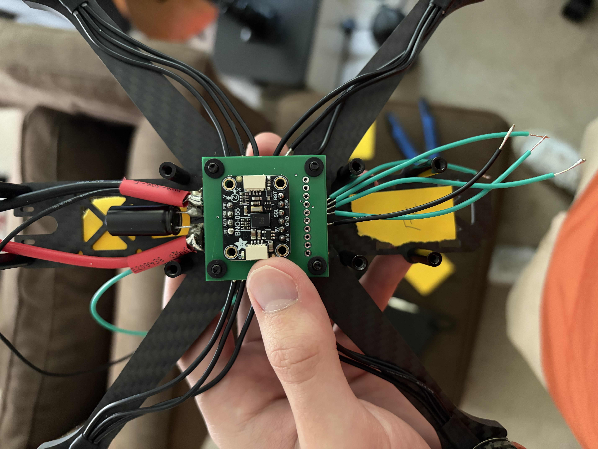
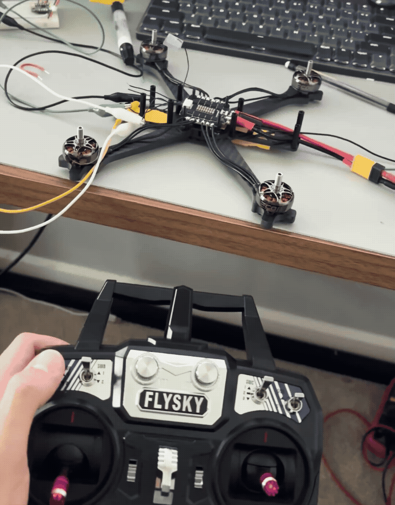

## DBV1 Feather

The DBV1 Feather is a quadcopter built for the primary purpose of developing my familiarity with embedded systems. The name, rather unoriginally, stands for Drone Build Version 1: Feather, with the Feather moniker reflecting he Adafruit STM32F405 Feather Express MCU breakout board that this project is built upon. 

Currently, the project lies in the testing phase, where I am dialing in the PID gain constants via a combination of trial-and-error, and quantitative flight log debugging. The primary goal at this stage of development is to achieve a hover for ten seconds.

	
	
  	

## Skills
- C Programming
	- Modular file system allows for easily swapping components if necessary
	- Register-level programming & bitwise operations
- PID controller implementation
- STM32 ecosystem (STM32F405 MCU, CubeMX, HAL)
- Direct Memory Access (DMA) for peripheral data transactions
	- Implemented DShot & iBus protocol from spec
- Using logic analyzer to debug I2C, DShot signals
- PCB design for IMU mount

## Development Notes
Articles I wrote explaining my thought process through key decisions

[Safety-Focused Serial Interface Development](Articles/DBV1_Safety-Focused_Serial_Interface_Development.md)

[iBus Protocol Overview](Articles/iBus_Protocol.md)

## Features
- Remote-control pilot input & stabilization via PID loop
	- Pitch, roll axes are angle-controlled, yaw is rate controlled by pilot
	- PID integrator windup clamp
- Safety: Dual-failsafe motor arming scheme + automatic receiver-based disarm command on signal loss + stale signal packet shutdown
- Flight data collection and logging via flash memory
- Serial interface: PID gain updates on-the-fly + flight data download capability
[picture of quad]

## Architecture
The firmware uses the Model-Conductor-Hardware (MCH) framework for the IMU and SPIFlash sub-systems, since these are the components most likely to change in the future. This framework isolates the register-level hardware interface from the rest of the program, so that if I switch to a new IMU or flash chip, I only need to change the Hardware-layer file, and not everything else on top of it. 
* __Hardware__: register-level interactions with peripherals reflecting datasheet information
* __Conductor__: Intermediate layer, calls hardware functions to update the model, but has no low-level knowledge
* __Model__: High-level, just a container of data for other sub-systems to interact with
The rest of the firmware consists of straightforward protocol implementations and logic so these were left to be implemented as singular files. 

## Hardware
- STM32F405 MCU
- BNO055 IMU
- Flysky FS-i6 transmitter and FS-iA6B reciever
- Lumenier Siege 55A 3-6S AM32 4-in-1 ESC
- EMAX ECO II Series 2306 Motor (2400KV)
- HQProp Freestyle DP 5X4.3X3V2S Propellers
- TBS Source One V6 5" Frame

## Lessons Learned 

The main thing that I've learned is that I need to dedicate even more time to the planning phase of a project, before I even start building. My goal was to finish this project over the summer between my first and second year at the University of Michigan, but that short timeframe led me rush through important steps. 

- Component Selection
	- I spent weeks selecting every component of this quadcopter. I learned a lot by doing this myself, but I also made mistakes due to a lack of experience, the most notable being my choice to use the BNO055 IMU. I chose it based on familiarity from a past project, and because it features built-in 9-axis data fusion, but it turned out to be almost fundamentally incompatible with project requirements. 
	- For one, it's factory default firmware does not include a data-ready interrupt signal, and because I used a version that came on a breakout board, I had no way to update it. And, more consequentially, it has a very slow 100Hz refresh rate. These two factors mean that my PID loop is both chained to a slow refresh rate, and is forced to use slightly outdated sensor data since I have no way of knowing when a new reading is taken.
    - From this, I learned that sometimes I don't have to try and reinvent the wheel. Betaflight, the industry standard flight controller software in the FPV hobby, has a [list](https://betaflight.com/docs/development/manufacturer/manufacturer-design-guidelines) of suggested hardware on their website that I will reference in the future. I plan to switch my IMU to their recommendation of the ICM-42688-P from TDK Invensense. Luckily, this shouldn't be too hard to do because of the MCH modularity built into my code.

- Wire harnessing design 
	- The inside of the flight controller bay is a mess of wires and splices. The worst example of this is the 5-way ground-wire splice that I was forced to incorporate at the last minute. It's not pretty, but it works. However, having so many splices increases the chances that one of them will break mid-flight due to the high vibration environment
	- In the future, I will plan out how many connections I have to make, and design a PCB if I realize that there are too many connections to make with wires alone. As I soldered the ground-wire behemoth splice together, I was kicking myself, because I had a perfectly good ground plane on my IMU mounting PCB, and had just not realized that I needed to add more through hole ground ports to it. 

## What's Next?
### Short-term
A majority of this quadcopter is perfectly workable, and is capable of flying at a high level. The primary bottleneck, I believe, is the BNO055 IMU. 

Switching to the ICM-42688-P will give me an exponentially faster data refresh rate of 32kHz, plus a data ready interrupt. Taking this raw data, I intend to run a fusion algorithm locally on the STM32 MCU, and then run the same PID loop as before, just at a greatly increased rate. This should improve stability dramatically. 

The ICM-42688-P comes in a surface-mount package, so I will need to fabricate another PCB to mount it on. For this new PCB, I will be sure to include plenty of ground holes to connect all of my components to. 

I should also design a full-fledged PCB. Using breakout boards is convenient and speeds up development, but they take up a lot of space, and wiring ends up very messy. The PCB would include: a buck converter, voltage divider for measuring battery voltage, STM32F405 MCU, IMU, USB connector for programming, and a JST connector for connecting to the ESC. Ideally, this PCB should fit in the 30.5x30.5mm flight stack like a real, off-the-shelf flight controller.

Seems like I have my work cut out for me.
### Long-term ideas: 
(These will likely take a long time to develop, but would be super cool)

- RPM-filtered IMU data: use bidirectional DShot communication with ESC to calculate the amount of vibration produced by the motors at a given RPM, and subtract that vibration out of the IMU data
- Add AM32 passthrough for programming ESCs directly via flight controller, instead of having to unplug ESC every time

## Acknowledgements

[Eunhye Seok/Mokhwaqsomssi](https://github.com/mokhwasomssi): Posted repo implementing DShot and iBus, used as general framework to help figure out how to implement DMA transactions

Tim Hanewich: Posted [articles](https://timhanewich.medium.com/my-greatest-engineering-accomplishment-the-scout-flight-controller-d8937fb45b24) on Medium explaining his process of building a flight controller himself. Proved that this project is technically feasible and provided a general path for me to follow.

Alexander Agrawal: Advised on hardware components, helped with brainstorming
